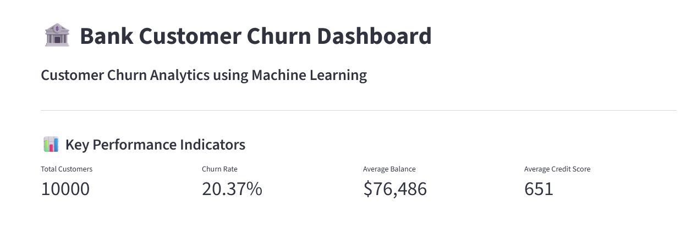
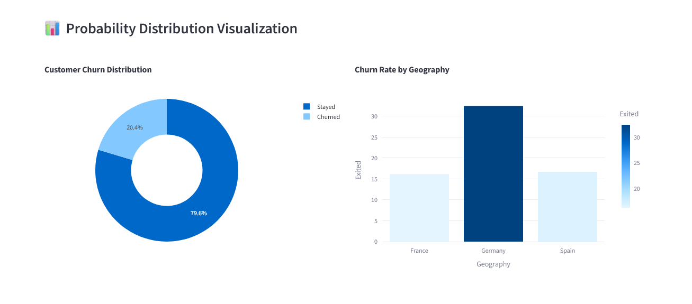
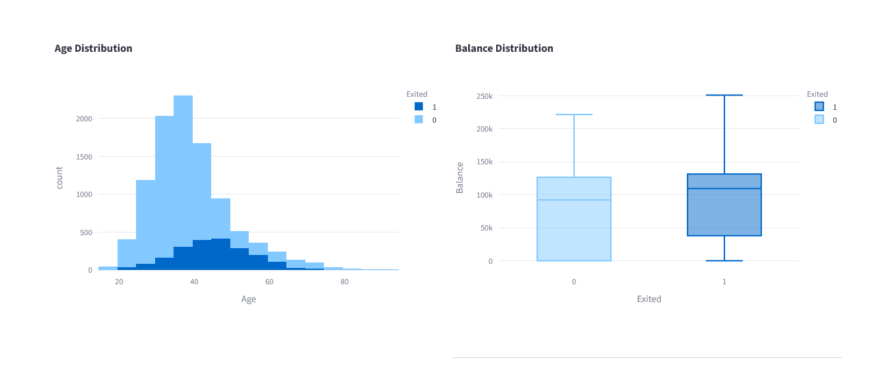
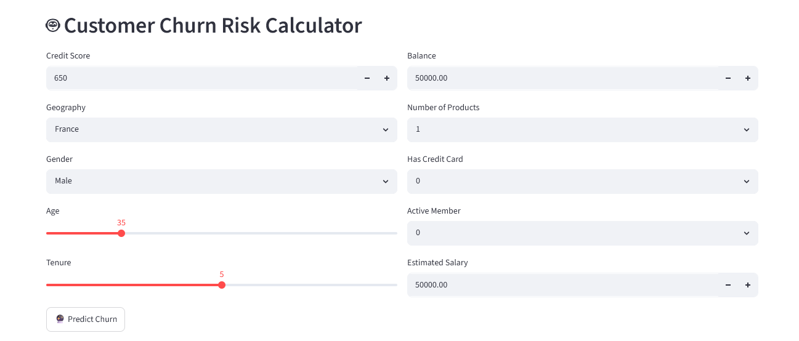
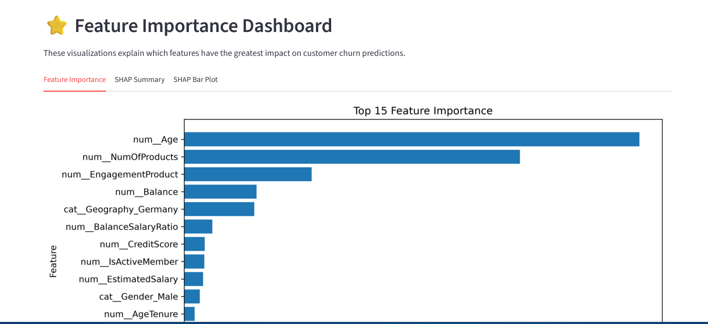
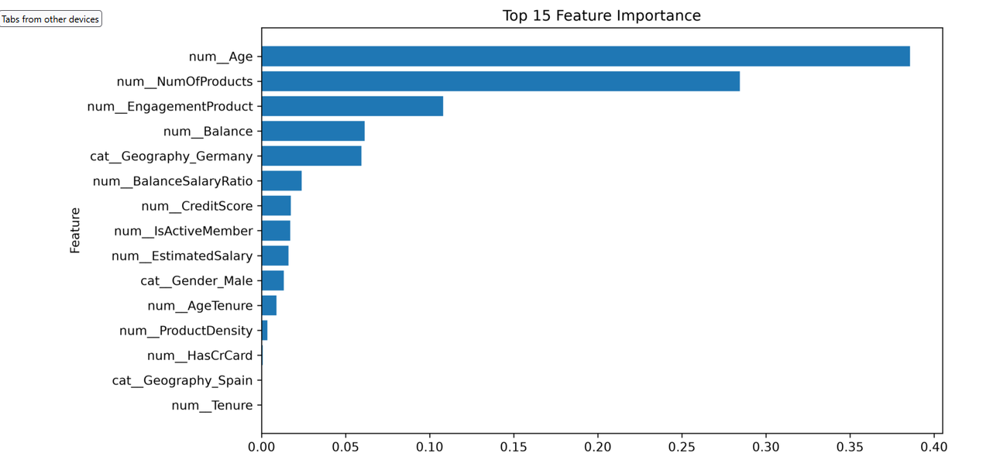
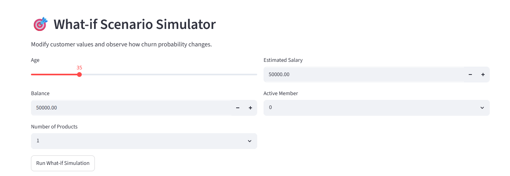

# 🏦 Bank Customer Churn Prediction using Machine Learning

## 🌐 Live Dashboard

👉 **Try the live application here:**

**🔗 Streamlit App:**  
https://bank-customer-churn-prediction-4gmwvgujuxk3yxgasmedbt.streamlit.app/

---

## 📂 GitHub Repository

🔗 https://github.com/ashutosh2417/Bank-Customer-Churn-Prediction

---

# 📌 Project Overview

This project predicts whether a bank customer is likely to churn using Machine Learning.

The solution includes an interactive Streamlit dashboard that enables users to:

- Predict customer churn
- Analyze customer behavior
- Explore feature importance
- Perform What-if analysis
- Visualize customer insights

---

## **🎓 Internship Project**

**This project was successfully completed as part of my Data Analytics Internship at Unified Mentor.**

During this internship, I designed and developed an end-to-end **Bank Customer Churn Prediction System** using Machine Learning and Streamlit. The project involved the complete analytics workflow, including data preprocessing, exploratory data analysis (EDA), feature engineering, predictive modeling, model evaluation, and deployment of an interactive web dashboard.

### **Skills Demonstrated**
- Data Cleaning & Preprocessing
- Exploratory Data Analysis (EDA)
- Feature Engineering
- Machine Learning Model Development
- Model Evaluation
- Streamlit Dashboard Development
- GitHub Version Control
- Cloud Deployment using Streamlit

---

# 🎯 Objectives

- Predict customer churn accurately
- Help businesses identify at-risk customers
- Visualize important customer behavior
- Build an interactive decision-support dashboard

---

# 🚀 Dashboard Features

## 📊 KPI Dashboard

- Total Customers
- Churn Rate
- Average Balance
- Average Credit Score

---

## 🤖 Customer Churn Risk Calculator

Users can enter:

- Credit Score
- Geography
- Gender
- Age
- Tenure
- Balance
- Products
- Credit Card Status
- Active Member
- Salary

Outputs include:

- Prediction
- Churn Probability
- Risk Gauge

---

## 📈 Probability Distribution Visualization

- Customer Churn Distribution
- Churn Rate by Geography
- Age Distribution
- Balance Distribution

---

## ⭐ Feature Importance Dashboard

Includes

- Feature Importance Plot
- SHAP Summary Plot
- SHAP Bar Plot

---

## 🎯 What-if Scenario Simulator

Users can modify customer information and instantly observe changes in churn probability.

---

## 📷 Dashboard Screenshots

### Home Dashboard


### Probability Distribution


### Age & Balance Distribution


### Customer Churn Risk Calculator


### Feature Importance Dashboard


### SHAP Visualizations


### What-if Scenario Simulator


# 🧠 Machine Learning Workflow

1. Data Collection
2. Data Cleaning
3. Feature Engineering
4. Data Preprocessing
5. Model Training
6. Model Evaluation
7. Dashboard Development

---

# 🛠 Technologies Used

- Python
- Streamlit
- Pandas
- NumPy
- Plotly
- Scikit-Learn
- SHAP
- Joblib

---

# 📂 Project Structure

```text
Bank_Customer_Churn_Prediction

├── app
├── data
├── images
├── models
├── notebooks
├── requirements.txt
├── README.md
└── .gitignore
```

---

# ▶️ Installation

```bash
git clone https://github.com/YOUR_USERNAME/Bank-Customer-Churn-Prediction.git
```

```bash
cd Bank-Customer-Churn-Prediction
```

```bash
pip install -r requirements.txt
```

```bash
streamlit run app/app.py
```

---

# 📊 Dataset

European Bank Customer Dataset

Target Variable

- Exited (Customer Churn)

---

# 🚀 Future Scope

- Real-time Prediction API
- Customer Segmentation
- Explainable AI Enhancements
- Business Recommendation Engine

---

# 👨‍💻 Author

**Ashutosh Sharma **

MBA Business Analytics

Amity University Online
 
---

⭐ If you found this project useful, please consider starring the repository.# Bank-Customer-Churn-Prediction
An end-to-end Machine Learning project that predicts customer churn using Python, Scikit-Learn and an interactive Streamlit dashboard.
